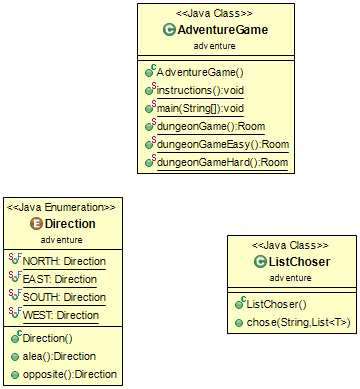
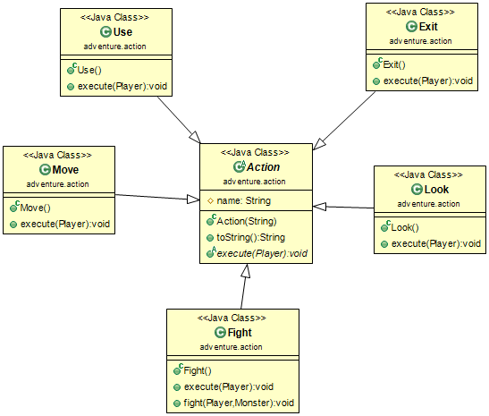
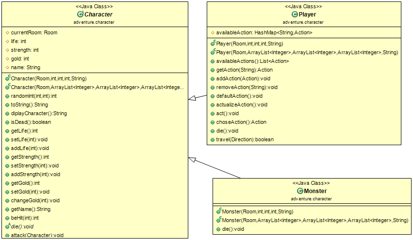
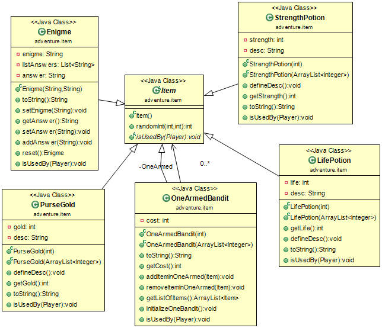
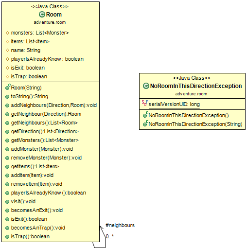
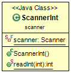

# TP 02 : Donjon
***************

Binôme :

	* Hugot Jean-Michel
	* Philippot Grégoire

## But du porjet

Le but de ce projet, consistait à créer un donjon où un player peut :

	- circuler de salle en salle grâce aux points cardinaux (north, south, east, west)
	grâce à l'action 'move'
	- récupérent des objets sur le sol augmantant soit ses points de vie,
	soit ses points de force ou soit ses bourses de pièces d'or 'use'
	- affronter des ennemis 'fight'
	- ou regarder ce qui se trouve dans la pièce 'look'

Le player doit réussir à survivre aux différents monstres, tout en pouvant récupérer des items dans les pièces du donjon.
Il gagne lorsu'il atteint la sortie.

-----

Différents points à "noter" :

	- afin de poursuivre son épopée dans le donjon,
	si une pièce est rempli d'ennemi(s), il faudra tous les tuer
	- lorsqu'un monstre meurt, ses items se mettent à terre et le joueur devra utiliser
	l'action 'use' pour les récupérer
	- dans le donjon, le joueur pourra acheter des items contre de l'or au bandit manchot
	- il existe différentes pièces : l'entrée, normales où il peut y avoir des richesse,
	piégées	où le joueur meurt instantanément, remplis de monstre(s), du bandit manchot et la sortie

Compléments :

	- pour les classes LifePotion, StrengthPotion, OneArmedBandit, Character, Player et Monster
	nous avons implémenté un constructeur dans lequel on donne en paramètre une liste d'entier
	qui comporte un min et un max et grâce à la méthode randomInt(min,max)
	on retourne l'entier entre le min et le max.
	- nous avons créé un nouvel item : Enigme. Il prend en paramètre l'énigme et sa réponse. Vous devrez ajouter à une liste différentes réponses possibles.
	- nous avons créé une nouvelle type de salle : trap. Lorsque le player y rentre, il ne peut plus en sortir et meurt.

-----

Les commandes à utiliser :
-------------------------

Afin de récupérer la projet Donjon :

	* si vous avez déjà "cloné" le projet principal dans un dossier, placé vous y et ouvrez-y un terminal. Puis exécutez la commande :

		$ git pull

	* si vous n'avez pas "cloné" le projet principal, placez vous dans le dossier que vous avez choisi pour. Et exécutez la commande :

		$ git clone https://gitlab-etu.fil.univ-lille1.fr/philippot/COO-TP.git

Afin de compiler et générer la documentation, placez vous dans le dossier du projet Donjon, après l'avoir mis à jour, et suivez les instructions :

I Compiler :

	$ mvn package

II Afin d’exécuter le fichier jar créer, vous devrez exécuter la commande :

	$ java -jar target/TP2-Donjon-1.0-SNAPSHOT.jar

	Après avoir exécuté cette commande, le jeu vous demandera la difficulté du donjon :
		- easy
		- hard
		- "" [rien, ou autre que easy ou hard].
	Puis le nom de votre personnage .
	Et enfin vous pourrez joueur.

Si vous voulez générer la documentation des classes :

	$ mvn javadoc:javadoc

Si vous voulez supprimer tous les fichiers "inutiles" :

	$ mvn clean

-----

Diagrammes UML :
----------------

### Adventure

### Action

### Character

### Item

### Room

### Scanner

-----

Code :
------

### Adventure
<pre>
	<code>
		//ENUM
		NORTH,EAST,SOUTH,WEST;
		public Direction opposite(){
			Direction[] d = Direction.values();
			return d[(this.ordinal()+2)%4];
		}
	</code>
</pre>
L'ordre instauré dans l'initialisation des différents attributs [enum] (NORTH,EAST,SOUTH,WEST) est très important, car c'est grâce à ceci qu'on peut retourner dans la méthode opposite() l'opposé d'une direction. (NORTH opposé de SOUTH et EAST opposé de WEAST).

### Action
<pre>
	<code>
		public abstract void execute(Player p);
	</code>
</pre>
Cette méthode appartient à la abstract classe Action.

Pour Exit, on affiche que le player est gagné car il est sortit vivant du donjon

Pour Fight, on affiche une liste de monstres pouvant être attaqué puis le player en choisit un, qu'il attaque, répétant cette action jusqu'à ce que tous les monstres soient morts.
Pour Look, on affiche la description d'une pièce.

Pour Move, on affiche les directions possibles sous la forme d'une liste (à choix multiples), et le player en sélectionne et s'y dirige

Pour Use, on affiche les différents items pouvant être ramassés/utilisables se trouvant dans la pièce et le player en sélectionne un. (Lorsque le player en a utilisé un, on le supprime de la liste des items se trouvant dans la pièce.)

### Character
<pre>
	<code>
		public void actualizeAction(){
			this.availableAction.clear();
			this.addAction(new Look());
			Room r = this.getRoom();
			if(!r.getItems().isEmpty()){
				this.addAction(new Use());
			}if(!r.getMonsters().isEmpty()){
				this.addAction(new Fight());
			}else{
				if(r.getItems().isEmpty()||!(r.getItems().get(0) instanceof Enigme)){
					this.addAction(new Move());
				}
			}
			if(r.isTrap()) {
				System.out.println(this.name+" enters a room, the door closes and walls come out of the peaks. "
						+ "The walls begin to advance. "
						+ "You can not do anything .... "
						+this.name+" says : It's a trap."
						+ "You're broken.");
				this.die();
			}
			if(r.isExit()){
				this.addAction(new Exit());
			}
		}
	</code>
</pre>
Tout d'abord on "clear" la liste des actions valables pour le player afin d'en instancier de nouvelles.

On met obligatoirement l'action Look permettant au player d'avoir les différentes informations sur la pièces.

Puis on vérifie dans la pièce actuel du player :

	- si la pièce comporte des items, on y ajoute le fait que le player puisse les récupérer
	- si la pièce comporte des monstres, on y ajoute la fait que le player puisse les affronter
	- sinon :
		- si la pièce ne comporte pas d'item ou que si elle ne comporte pas dans sa liste d'item
		en son premier terme un élément du type Enigme, le joueur puisse se déplacer
	- si la salle actuel est un piège, on décrit se qui s'y passe et le joueur meurt
	- si la salle est la sortie, le jeu est fini

### Item
<pre>
	<code>
		public void isUsedBy(Player player) {
			System.out.println("Welcome in my store.");
			if(player.getGold() >= this.cost) {
				this.initializeOneBandit();
				ListChoser lc = new ListChoser();
				Item item = lc.chose("For "+this.cost+" gold, choose an item : ",this.OneArmed);
				item.isUsedBy(player);
				player.changeGold(-this.cost);
				this.OneArmed.clear();
				player.act();
			}
			else {
				System.out.println("You do not have enough money, come back when you get more."+"\n"+"TIGHTFISTED");
				player.act();
			}
		}
	</code>
</pre>
Si player a assez d'argent :

Il s'agit de la méthode isUsedBy(player) de la classe OneArmedBandit.

On instancie une liste d'item composé d'une potion de vie, de force, d'une bourse d'or et d'un nouveau OneArmedBandit

On demande au player de choisir quel élément il veut acheter, puis on luis affecte la valeur de l’élément.

On "clear" la liste afin que le player si il revient dans la pièce, il n'est le choix qu'entre 4 (nouveaux) éléments.

Sinon: Il ne se passe rien.

### Room
<pre>
	<code>
		public String toString(){
			String roomDescription = "This is room is name "+this.name+".\n";
			roomDescription+="This room are "+this.neighbours.size()+" door(s).\n";
			if(!this.monsters.isEmpty()){
				roomDescription+="This room are "+this.monsters.size()+" monster(s).\n";
				//roomDescription+="To continue your adventure, you must kill the monster/ all monsters.\n";
			}
			if(!this.items.isEmpty()) {
				roomDescription+="This room are "+this.items.size()+" item(s)."+"\n";
				//roomDescription+="You can continue your adventure without recovering the items.\n";
			}
			if(this.isExit()) {
				roomDescription+="This room is an exit.";
			}
			if(this.isTrap()) {
				roomDescription+="This room is very strange.";
			}
			return roomDescription;
		}
	</code>
</pre>
Cette méthode permet d'afficher la description de la pièce dans laquelle se situe le player:

	- le nom de la salle
	- le nombre de pièces voisines
	- le nombre de monstres dans la pièce
	- le nombre d'items dans la pièce
	- si il s'agit de la sortie
	- si il s'agit d'un piège

### Scanner
<pre>
	<code>
		public static int readInt(int n) {
			int input = -1;
			while (input < 0 || input >= n) {
				System.out.print("your choice (1-" + (n - 1) + ") ? ");
				try {
					input = scanner.nextInt();
				} catch (InputMismatchException	 e){
					scanner.skip(".*");
				}
			}
			return input;
		}
	</code>
</pre>
Nous avons réutilisé le code donné par le fil pour le tp 01.
