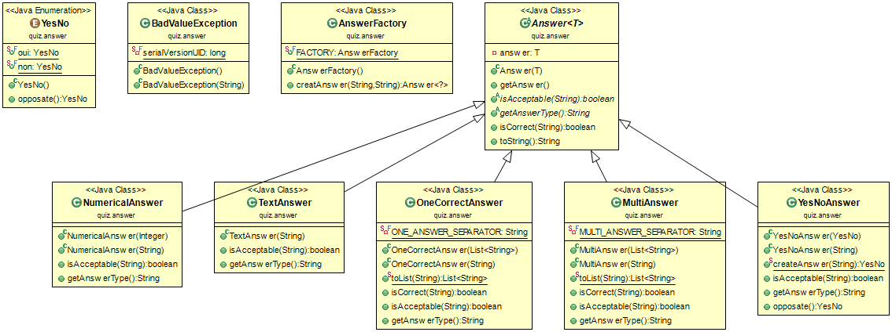
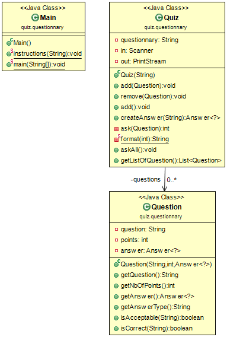
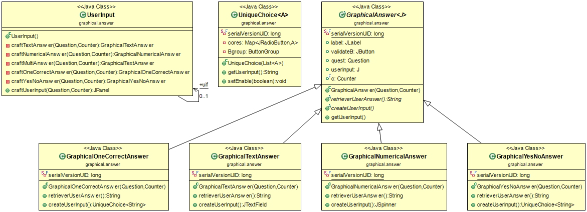
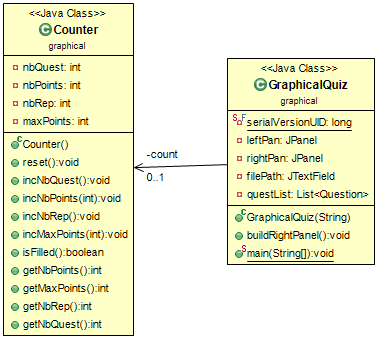
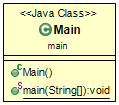

#TP 04 : QUESTIONNARY
*********************

Binôme :

	* Hugot Jean-Michel
	* Philippot Grégoire

### Le but de ce projet est :

	* réaliser, grâce à un fichier fourni, un questionnaire où l'utilisateur répondra aux différentes questions en gagnant des points si il a bon ou sinon en lui affichant la bonne réponse.
	* puis réaliser une interface graphique, grâce à Swing, du questionnaire.

### Eléments à prendre en compte :

###### Dans le package graphical

	* si vous appuyez sur un bouton "VALIDATE" lors de JRadioButton sans avoir choisit une réponse, il y aura un problème avec la suite de l'exécution du programme.

### Elements à améliorer :

###### Dans le package graphical

	* mettre à la ligne les différents éléments du panel de droite (dans la frame principale)
	* mettre un bouton VALIDATE dans le panel de droite (dans la frame principale) qui effectue les tâches des boutons "VALIDATE".

###### Dans le package quiz

	* mettre un deuxième attributs dans la classe OneCorrectAnswer, qui correspond à la vrai answer. Pour ne pas utiliser : return this.getAnswer().get(0).toLowerCase().equals(ans.toLowerCase());. On pourrait penser mettre à la fin de la ligne d'une réponse de type OneCorrect 2 "|" (exemple : Bill | Bourricot | Robert | Jolly Jumper || Bill)
	* utiliser la classe AnswerFactory pour créer les Answer (à la place de la méthode createAnswer(String ans) de la classe Quiz.java)

Les commandes à utiliser :
-------------------------

Se placer dans la racine du projet :  puis ouvrir un terminal dans ce dernier

1. Compiler :

	$ mvn package

2. Afin d’exécuter le fichier jar créer, vous devrez exécuter la commande :

	$ java -jar target/TP04-QUIZ-1.0-SNAPSHOT.jar {option} {file}

	{option} :

		* -t : il exécutera la manière textuel du TP, puis vous choisirez le fichier du questionnaire.
		-> {file}:
			* question_tolkien.txt
			* question_tolkien_2.txt
		* -g : il exécutera la manière graphique du TP.

Si vous voulez générer la documentation des classes :

	$ mvn javadoc:javadoc

Si vous voulez supprimer tous les fichiers "inutiles" :

	$ mvn clean

## POJECT

## Package QUIZ

Diagrammes UML :
----------------

### Answer

### Quiz

Code :
------

### Answer
<pre>
	<code>
		//CLASS ONE CORRECT ANSWER
		public OneCorrectAnswer(String ans) throws BadValueException {
			this(toList(ans));
		}
		public static List<String> toList(String ans) throws BadValueException{
			if(!ans.contains(ONE_ANSWER_SEPARATOR)) {
				throw new BadValueException();
			}
			return Arrays.asList(ans.split(" \\"+ONE_ANSWER_SEPARATOR+" "));
		}

		//CLASS MULTI ANSWER
		public MultiAnswer(String ans) throws BadValueException{
			this(toList(ans));
		}
		public static List<String> toList(String ans) throws BadValueException{
			if(!ans.contains(MULTI_ANSWER_SEPARATOR)) {
				throw new BadValueException();
			}
			return Arrays.asList(ans.split(" "+MULTI_ANSWER_SEPARATOR+" "));
		}
	</code>
</pre>
Ici les méthodes toList permmettent de créer une liste de String qui sera affecté à l'attributs answer.
Dans les deux méthodes toList, nous cherchons le séparateur des différentes réponses possibles puis on les split.

### Quiz
<pre>
	<code>
		//CLASS QUIZ
		private int ask(Question question) {
			Answer<?> answer = question.getAnswer() ;
			out.println(question.getQuestion()) ;
			String userAnswer = null;
			do {
				out.print("[" + answer.getAnswerType() + "]") ;
				userAnswer = in .nextLine();
			} while (! answer.isAcceptable(userAnswer)) ;
			if (answer.isCorrect(userAnswer)) {
				int points = question.getNbOfPoints() ;
				out.println("correct (" + format(points) + ")") ;
				return points ;
			} else {
				if(answer instanceof OneCorrectAnswer) {
					out.println("incorrect, la bonne réponse était "+answer.getAnswer().toString().substring(1,5));
				}
				else {
					out.println("incorrect, la bonne réponse était " + answer.getAnswer().toString()) ;
				}
				return 0 ;
			}
		}
	</code>
</pre>
La méthode ask permet à partir d'une question entré en paramètre de vérifier si la réponse entrée par l'utilisateur.
Si elle est bonne on retourne le nombre de points de la question.
Sinon on retourne la bonne réponse et l'entier 0.

## Package GRAPHICAL

Diagrammes UML :
----------------

### Answer

### Graphical

Code :
------

### Answer
<pre>
	<code>
		//CLASS UNIQUE CHOICE
		public UniqueChoice(List<A> choices) {
			super();
			this.setLayout(new GridLayout(1,2));
			this.Bgroup = new ButtonGroup();
			this.cores = new HashMap<JRadioButton, A>();
			for(A c : choices) {
				JRadioButton j = new JRadioButton(c.toString());
				this.Bgroup.add(j);
				this.cores.put(j,c);
				this.add(j);
			}
		}
	</code>
</pre>
Cette méthode permet de créer un JRadioButton ("o") pour chaque choix de réponses possibles.

### Graphical
<pre>
	<code>
		//CLASS USER INPUT
		public JPanel craftUserInput(Question quest, Counter c) throws BadValueException {
			String answerType = quest.getAnswer().getAnswerType();
			if("type : multi answer.".equals(answerType)){
				return this.craftMultiAnswer(quest, c);
			}if("type : numerical answer.".equals(answerType)){
				return this.craftNumericalAnswer(quest, c);
			}if("type : one correct answer.".equals(answerType)){
				return this.craftOneCorrectAnswer(quest, c);
			}if("oui".equals(quest.getAnswer().toString().toLowerCase())||"non".equals(quest.getAnswer().toString().toLowerCase())) {
				return this.craftYesNoAnswer(quest, c);
			}if("type : text answer.".equals(answerType)){
				return this.craftTextAnswer(quest, c);
			}
			return null;
		}
	</code>
</pre>
Cette méthode permet de créer un JPanel en fonction du type de la question ou de la réponse attendue.

## Package MAIN

Diagrammes UML :
----------------

### Main

Code :
------

### Main
<pre>
	<code>
		//CLASS MAIN
		public static void main(String args[]) throws IOException, BadValueException{
			if(args.length == 2) {
				if("-t".equals(args[0])){
					JOptionPane.showMessageDialog(null, "You choose the textual option and "+args[1]+" file.");
					Quiz quiz = new Quiz(args[1]);
					quiz.add();
					quiz.askAll();
				}
			}
			if("-g".equals(args[0])){
				JOptionPane.showMessageDialog(null, "You choose the graphical option.");
				JFrame window = new GraphicalQuiz("Questionnary");
				window.setVisible(true);
			}else{
				System.out.println("Choice q or g option to execute this main !");
				System.exit(0);
			}
		}
	</code>
</pre>
L'utilisateur choisit en premier argument l'option :
	* -t : textual
	* -g : graphical
S'il choisit l'option -t, il devra rentrer un deuxième argument qui correspond au nom du fichier
