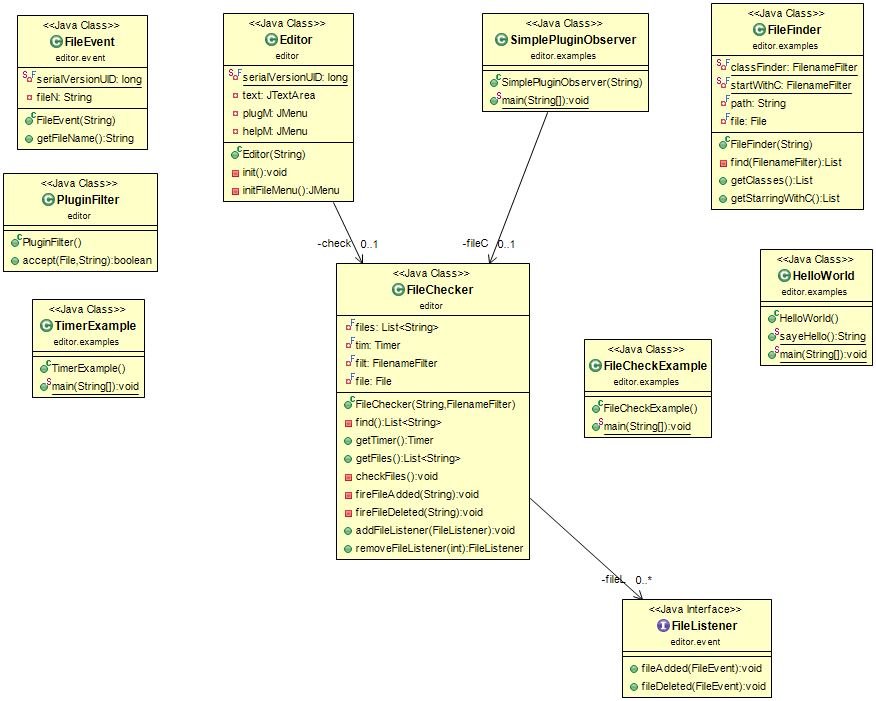
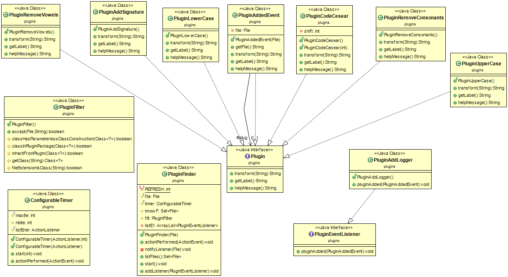

#TP 05 : PLUGINS
****************

Binôme :

	* Hugot Jean-Michel
	* Philippot Grégoire

Le but du projet est de :
	
	* réaliser un éditeur de texte, dans lequel on peut implémenter des options (telles que la suppression de toutes les voyelles du texte se trouvant dans l'éditeur)	

	
Les commandes à utiliser :
--------------------------

Se placer dans la racine du projet :  puis ouvrir un terminal dans ce dernier

1. Compiler :

	$ mvn package

2. Afin d’exécuter le fichier jar créer, vous devrez exécuter la commande :
	
	$ java -jar target/TP05-PLUGINS-1.0-SNAPSHOT

Si vous voulez générer la documentation des classes :

	$ mvn javadoc:javadoc

Si vous voulez supprimer tous les fichiers "inutiles" :

	$ mvn clean
	

## EDITOR
	

## PLUGIN

