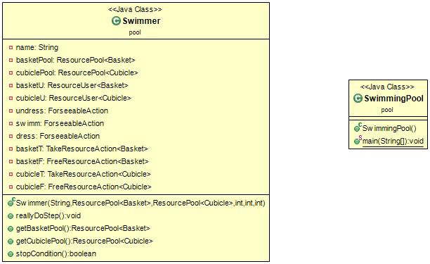
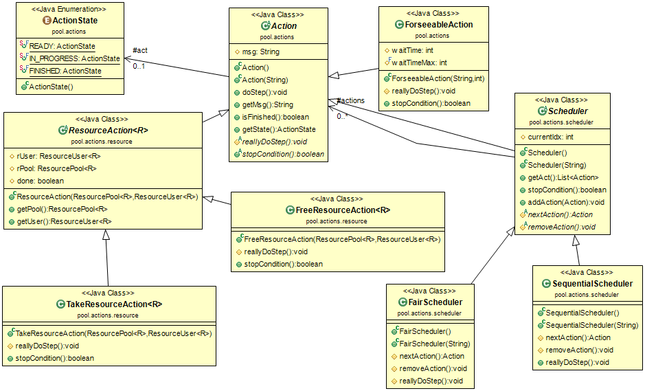
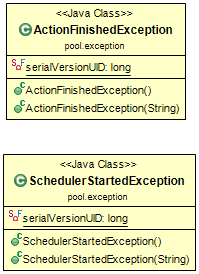
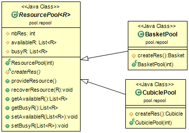
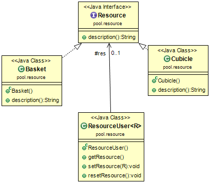

# TP 03 : POOL
***************

Binôme :

	* Hugot Jean-Michel
	* Philippot Grégoire

## But du porjet

-----

Il consiste à résoudre le problème de la piscine : gérer une piscine contenant des casiers et des cabines (Basket et Cubicle) grâce à des ordonnances servant à planifier et organiser les éventuelles files d'attentes.

### Problèmes rencontrés / Eléments non-finis :
------------------------

Nous avons rencontrés deux problèmes :
	
	* le nombres d'étapes finales est de 212 à la place de 242.
	
	* lorsqu'on utilise la commande $ mvn package, cela ne compile pas à cause des "fail" des tests.
	

Nous n'avons pas pu finir les tests pour Swimmer.java et ResourceAction.

Les commandes à utiliser :
-------------------------

Afin de récupérer la projet Pool :

	* si vous avez déjà "cloné" le projet principal dans un dossier, placé vous y et ouvrez-y un terminal. Puis exécutez la commande :

		$ git pull

	* si vous n'avez pas "cloné" le projet principal, placez vous dans le dossier que vous avez choisi pour. Et exécutez la commande :

		$ git clone https://gitlab-etu.fil.univ-lille1.fr/philippot/COO-TP.git

Afin de compiler et générer la documentation, placez vous dans le dossier du projet Pool, après l'avoir mis à jour, et suivez les instructions :

I Compiler :

	$ mvn package

II Afin d’exécuter le fichier jar créer, vous devrez exécuter la commande :

	$ java -jar target/TP03-POOL-1.0-SNAPSHOT

Si vous voulez générer la documentation des classes :

	$ mvn javadoc:javadoc

Si vous voulez supprimer tous les fichiers "inutiles" :

	$ mvn clean

-----

Diagrammes UML :
----------------

### Pool

### Actions

### Exception

### Resource Pool

### Resource

-----

Code :
------

### Pool
<pre>
	<code>
		@Override
		public void reallyDoStep() throws ActionFinishedException, NoSuchElementException {
			System.out.println(this.name+"'s turn.");
			if(this.basketU.getResource() == null) {
				System.out.println(this.name+" trying to take resource froom pool basket...");
				this.basketT.doStep();
			}else if(!this.undress.isFinished()) {
				if(this.cubicleU.getResource() == null) {
					System.out.println(this.name+" trying to take resource froom pool cubicle...");
					this.cubicleT.doStep();
				}else {
					this.undress.doStep();
				}
			}else if(this.cubicleU.getResource() != null && !this.swimm.isFinished()) {
				this.cubicleF.doStep();
			}else if(!this.swimm.isFinished()) {
				this.swimm.doStep();
			}else if(this.cubicleU.getResource() != null && !this.dress.isFinished()) {
				System.out.println(this.name+" trying to take resource froom pool cubicle...");
				this.cubicleT.doStep();
			}else if(!this.dress.isFinished()) {
				this.dress.doStep();
			}else if(this.cubicleU.getResource() != null && this.dress.isFinished()) {
				this.cubicleF.doStep();
			}else {
				this.basketF.doStep();
			}
		}
	</code>
</pre>
On teste chaque possibilitées, dans l'ordre suivant : 

	- take a basket
	- take a cubicle
	- check undress
	- free cubicle
	- check swimm
	- take cubicle
	- check dress
	- free cubicle
	- free basket

### Actions
<pre>
	<code>
		public void doStep() throws ActionFinishedException, NoSuchElementException{
		    if(this.isFinished()){
		      throw new ActionFinishedException("action is finisehd");
		    }
		    if(this.msg != null){
		      System.out.println(this.msg);
		    }
		    this.reallyDoStep();
		    if(this.stopCondition()){
		      this.act = ActionState.FINISHED;
		    }
		}
	</code>
</pre>
On regarde d'abord si on peut effectuer une action, puis on affiche un message si présent, puis on fait reallyDoStep() et enfin on regarde si on a l'action qui est finie.

### Resource Pool
<pre>
	<code>
		public R provideResource() throws NoSuchElementException{
			if(this.availableR.isEmpty()) {
				throw new NoSuchElementException();
			}else {
				R res = this.availableR.get(0);
				this.busyR.add(res);
				System.out.println(res.description());
				this.availableR.remove(res);
				return res;
			}
		}
	</code>
</pre>
On regarde d'abord si la liste d'actions possible est vide:
	
	- si c'est le cas on retourne une erreur
	- sinon on prend le premier élement de liste "available", puis on l'ajoute à "busy", on affiche ensuite la description de la resource et enfin on peut la supprimer des "available" et la retourner.

### Resource
<pre>
	<code>
		public String description();
	</code>
</pre>
La description dépend de la resource : basket ou cubicle.
