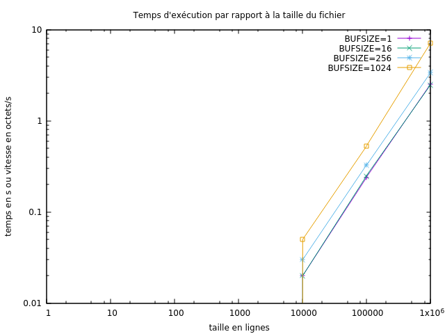

#   Performances des entrées/sorties

Ce répertoire correspond aux exercices de la section
[Performances des entrées/sorties](http://www.fil.univ-lille1.fr/~hym/e/pds/tp/tdfs-perfio.html).

Vous éditerez ce fichier pour qu’il contienne un **compte-rendu du
travail effectué**. Il devra notamment contenir :

-   les résultats (connexion entre le temps d’exécution et la taille
    des buffers utilisés, notamment) que vous avez obtenus ; ces
    résultats pourront par exemple être des graphiques produits par
    `gnuplot`,
-   les conclusions que vous avez tirées de vos expériences.

*Remarque*
Si vos temps sont essentiellement 0, vos expériences ne sont pas significatives, il faut en faire d’autres !

*man*
getenv

atoi

malloc

# Commandes

  * $ make all
  * puis $ ./mcat-scd {fichier à cat}

  OU

  * $ ./script.sh ; exécutera les différents scripts pour différents BUFSIZE

  * se placer dans le dossier courbes
  * $ gnuplot run.gnu

*Travail réalisé*
mcat-scd:
  - création d'une fonction vérifiant que le paramètre soit bien un fichier
  - création dans un premier temps d'un cat réalisant un affichage sans utilisation de tampon
  - création d'un cat répondant aux attentes
  - création du script à exécuter afin de tester le temps d'exécution du cat créé
  - création d'un fichier run.gnu à exécuter afin de récupérer les courbes d'exécution
  - création d'un script ayant pour but de créer des fichiers de mémoires (en o) différentes et modification du script d'exécution du cat

*Courbe*

